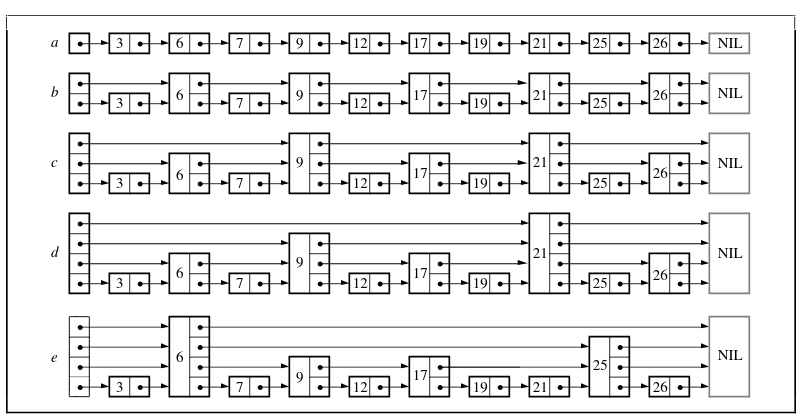
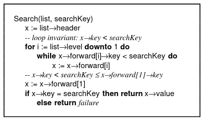
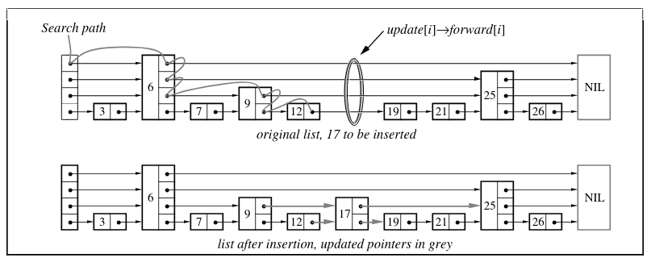
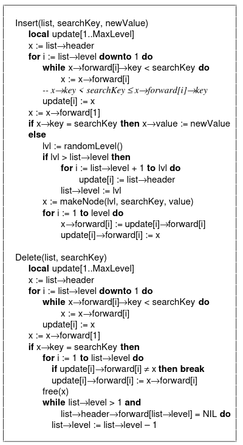
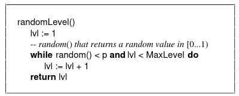
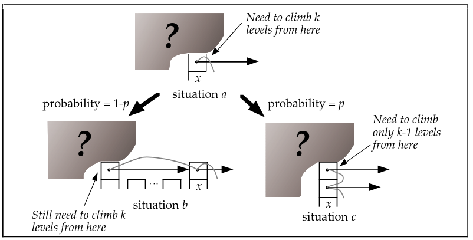
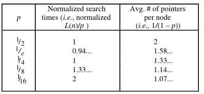
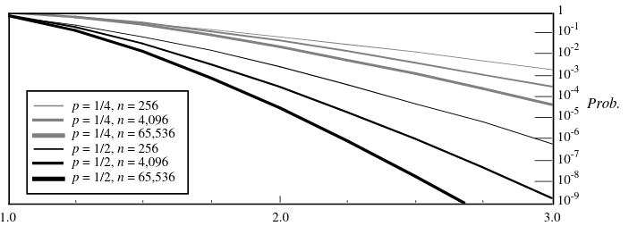
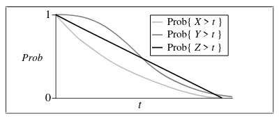

# **Skip Lists: вероятностная альтернатива сбалансированным деревьям**

> Пропускные списки (Skip Lists) — это структура данных, которая может использоваться вместо сбалансированных деревьев.
> Пропускные списки используют вероятностное балансирование, а не строгое принудительное, и в результате алгоритмы вставки и удаления в пропускных списках **намного проще** и **значительно быстрее**, чем эквивалентные алгоритмы для сбалансированных деревьев.

## **Уильям Паг**

Двоичные деревья могут использоваться для представления абстрактных типов данных, таких как словари и упорядоченные списки. Они хорошо работают, когда элементы вставляются в случайном порядке. Некоторые последовательности операций, например вставка элементов по порядку, порождают дегенеративные структуры данных, которые демонстрируют очень плохую производительность. Если бы было возможно случайным образом переставить список элементов, предназначенных для вставки, деревья с высокой вероятностью работали бы хорошо для любой входной последовательности. В большинстве случаев запросы должны обрабатываться онлайн, поэтому случайная перестановка входных данных непрактична. Алгоритмы сбалансированных деревьев перестраивают дерево по мере выполнения операций, чтобы поддерживать определённые условия баланса и обеспечивать хорошую производительность.

Пропускные списки являются вероятностной альтернативой сбалансированным деревьям. Пропускные списки балансируются с помощью генератора случайных чисел. Хотя пропускные списки имеют плохую производительность в худшем случае, ни одна входная последовательность последовательно не вызывает худший случай (похоже на быструю сортировку, когда опорный элемент выбирается случайно). Очень маловероятно, что структура данных skip list будет сильно несбалансированной (например, для словаря из более чем 250 элементов вероятность того, что поиск займёт более чем в 3 раза больше времени, чем ожидаемое, меньше одной на миллион).

Пропускные списки обладают свойствами баланса, аналогичными деревьям поиска, построенным случайными вставками, но при этом не требуют, чтобы вставки были случайными. Балансировка структуры данных вероятностным образом проще, чем явное поддержание баланса. Для многих приложений пропускные списки являются более естественным представлением, чем деревья, что также ведёт к более простым алгоритмам. Простота алгоритмов пропускных списков облегчает их реализацию и обеспечивает значительное ускорение по константному фактору по сравнению с алгоритмами сбалансированных деревьев и самонастраивающихся деревьев. Пропускные списки также очень эффективны по использованию памяти. Их легко настроить так, чтобы в среднем требовался 1⅓ указателя на элемент (или даже меньше), и при этом нет необходимости хранить информацию о балансе или приоритетах в каждом узле.

## **Пропускные списки**

При поиске в связном списке нам может понадобиться проверить каждый узел списка (Рисунок 1a). Если список хранится в отсортированном порядке, и каждый второй узел списка также имеет указатель на узел через один (Рисунок 1b), нам придётся проверить не более чем ⌈n/2⌉ + 1 узлов (где n — длина списка). Если каждому четвёртому узлу дать указатель через три узла (Рисунок 1c), потребуется проверить не более чем ⌈n/4⌉ + 2 узлов.

Если каждый (2^i)-й узел имеет указатель на 2^i узлов вперёд (Рисунок 1d), количество проверяемых узлов может быть сокращено до ⌈log₂ n⌉ при удвоении количества указателей. Такая структура данных могла бы использоваться для быстрого поиска, но вставка и удаление были бы непрактичными.

Узел, имеющий k forward-указателей, называется узлом уровня k. Если каждый (2^i)-й узел имеет указатель на 2^i узлов вперёд, уровни узлов распределяются по простой схеме: 50% — уровень 1, 25% — уровень 2, 12,5% — уровень 3 и так далее. Что произойдёт, если уровни узлов выбрать случайным образом, но в тех же пропорциях (например, как на Рисунке 1e)? i-й forward-указатель узла, вместо того чтобы указывать на 2^i–1 узлов вперёд, указывает на следующий узел уровня i или выше. Вставка или удаление потребуют только локальных изменений; уровень узла, выбранный случайным образом при вставке, никогда не изменяется. Некоторые распределения уровней могут дать плохое время выполнения, но мы увидим, что такие распределения встречаются редко. Поскольку эти структуры данных являются связанными списками с дополнительными указателями, которые перескакивают через промежуточные узлы, я назвал их **пропускными списками**.

## **Алгоритмы пропускных списков**

В этом разделе описаны алгоритмы поиска, вставки и удаления элементов в словаре или таблице символов. Операция **Search** возвращает значение, связанное с нужным ключом, или сообщает об отсутствии ключа. Операция **Insert** связывает указанный ключ с новым значением (вставляя ключ, если он ещё не присутствовал). Операция **Delete** удаляет заданный ключ. Легко поддерживать дополнительные операции, такие как «найти минимальный ключ» или «найти следующий ключ».

Каждый элемент представлен узлом, уровень которого выбирается случайным образом при вставке, независимо от количества элементов в структуре. Узел уровня i имеет i forward-указателей, индексированных от 1 до i. Нет необходимости хранить уровень узла внутри самого узла. Уровни ограничены некоторой подходящей константой MaxLevel. Уровень списка — это максимальный уровень на данный момент (или 1, если список пуст). Заголовок списка имеет forward-указатели на уровнях от 1 до MaxLevel. Forward-указатели заголовка на уровнях выше текущего максимального уровня списка указывают на NIL.

### **Инициализация**

Выделяется элемент NIL и ему присваивается ключ, больший, чем любой допустимый ключ. Все уровни всех пропускных списков завершаются NIL. Новый список инициализируется так, что уровень списка равен 1, а все forward-указатели заголовка списка указывают на NIL.

### **Алгоритм поиска**

Мы ищем элемент, перемещаясь по forward-указателям так, чтобы не «перепрыгнуть» узел, содержащий искомый элемент (Рисунок 2). Когда на текущем уровне forward-указателей невозможно продвинуться дальше, поиск переходит на следующий уровень вниз. Когда на уровне 1 невозможно сделать больше шагов, мы должны оказаться непосредственно перед узлом, который содержит нужный элемент (если он присутствует в списке).

### **Алгоритмы вставки и удаления**

Для вставки или удаления узла мы просто выполняем поиск и «вшиваем» узел, как показано на Рисунке 3. На Рисунке 4 приведены алгоритмы для вставки и удаления. Поддерживается вектор **update**, так что после завершения поиска (и когда мы готовы выполнить вставку или удаление) `update[i]` содержит указатель на самый правый узел уровня i или выше, который находится слева от позиции вставки/удаления.

Если вставка создаёт узел с уровнем, большим, чем предыдущий максимальный уровень списка, мы обновляем максимальный уровень списка и инициализируем соответствующие части вектора **update**. После каждого удаления проверяется, удалён ли максимальный элемент списка; если да, максимальный уровень списка уменьшается.

### **Выбор случайного уровня**

Изначально мы обсуждали распределение вероятностей, при котором половина узлов с указателями уровня i также имеет указатели уровня i+1. Чтобы отказаться от «магических констант», мы говорим, что доля **p** узлов с указателями уровня i также имеет указатели уровня i+1 (для нашего первоначального обсуждения p = 1/2). Уровни генерируются случайным образом алгоритмом, эквивалентным показанному на Рисунке 5. Уровни генерируются без учета количества элементов в списке.

### **На каком уровне начинать поиск? Определение L(n)**

В пропускном списке из 16 элементов с p = 1/2 может получиться, что 9 элементов — уровня 1, 3 элемента — уровня 2, 3 элемента — уровня 3 и 1 элемент — уровня 14 (это очень маловероятно, но возможно). Как с этим справиться? Если мы используем стандартный алгоритм и начнем поиск на уровне 14, мы выполним много лишней работы.

Где следует начинать поиск? Наш анализ показывает, что оптимально начинать поиск на уровне L, где ожидается 1/p узлов. Это происходит, когда L = log₁/ₚ n. Поскольку мы будем часто обращаться к этой формуле, мы будем обозначать L(n) как log₁/ₚ n.

Существует несколько решений для случая, когда в списке есть элемент с необычно большим уровнем:

- Не переживайте, будьте счастливы. Просто начинайте поиск на самом высоком уровне, присутствующем в списке. Как мы увидим в анализе, вероятность того, что максимальный уровень в списке из n элементов значительно больше L(n), очень мала. Начало поиска с максимального уровня списка добавляет лишь небольшую константу к ожидаемому времени поиска. Именно такой подход используется в алгоритмах, описанных в этой статье.

• **Использовать меньше, чем дано.** Хотя элемент может содержать место для 14 указателей, нам не обязательно использовать все 14. Мы можем выбрать использование только L(n) уровней. Существует несколько способов реализовать это, однако все они усложняют алгоритмы и не дают заметного улучшения производительности, поэтому данный подход не рекомендуется.

• **Подправить кости.** Если мы генерируем случайный уровень, который более чем на единицу превышает текущий максимальный уровень списка, мы просто используем значение, равное текущему максимальному уровню списка плюс один, в качестве уровня нового узла. На практике и интуитивно это изменение кажется работающим хорошо. Однако оно полностью разрушает нашу возможность анализировать получающиеся алгоритмы, поскольку уровень узла больше не является полностью случайным. Программисты, вероятно, могут свободно реализовывать это, но пуристы должны этого избегать.

### **Определение MaxLevel**

Поскольку мы можем безопасно ограничить уровни значением L(n), следует выбирать MaxLevel = L(N) (где N — верхняя граница числа элементов в пропускном списке). Если p = 1/2, использование MaxLevel = 16 является подходящим для структур данных, содержащих до 2¹⁶ элементов.

## **АНАЛИЗ АЛГОРИТМОВ ПРОПУСКНЫХ СПИСКОВ**

Время, необходимое для выполнения операций Search, Delete и Insert, определяется в основном временем, требуемым для поиска соответствующего элемента. Для операций Insert и Delete существует дополнительная стоимость, пропорциональная уровню вставляемого или удаляемого узла. Время, необходимое для нахождения элемента, пропорционально длине пути поиска, которая определяется тем, в каком порядке элементы разных уровней встречаются при обходе списка.

### **Вероятностная философия**

Структура пропускного списка определяется только количеством

элементов в пропускном списке и результатами обращения к генератору случайных чисел. Последовательность операций, которая привела к текущему состоянию пропускного списка, не имеет значения. Мы предполагаем, что враждебный пользователь не имеет доступа к уровням узлов; в противном случае он мог бы создавать ситуации с худшим временем выполнения, удаляя все узлы, которые не имеют уровня 1.

Вероятности плохих времен выполнения для последовательных операций над одной и той же структурой данных НЕ являются независимыми; два последовательных поиска одного и того же элемента займут совершенно одинаковое время. Позже об этом будет сказано больше.

### **Анализ ожидаемой стоимости поиска**

Мы анализируем путь поиска в обратном направлении, двигаясь вверх и влево. Хотя уровни узлов в списке известны и фиксированы в момент выполнения поиска, мы ведем себя так, как будто уровень узла определяется только тогда, когда он наблюдается при обратном проходе по пути поиска.

В любой конкретный момент подъема мы находимся в ситуации, аналогичной ситуации a на Рисунке 6 — мы находимся у i-го forward-указателя узла x и не имеем информации об уровнях узлов слева от x или об уровне самого x, кроме того, что уровень x должен быть не меньше i. Предположим, что x не является заголовком (это эквивалентно предположению, что список бесконечно продолжается влево). Если уровень x равен i, то мы находимся в ситуации b. Если уровень x больше i, то мы находимся в ситуации c. Вероятность того, что мы находимся в ситуации c, равна p. Каждый раз, когда мы находимся в ситуации c, мы поднимаемся на один уровень вверх.

Пусть C(k) = ожидаемая стоимость (то есть длина) пути поиска, который поднимается на k уровней в бесконечном списке:

C(0) = 0
C(k) = (1–p) (стоимость в ситуации b) + p (стоимость в ситуации c)

Подставляя и упрощая, получаем:

C(k) = (1–p) (1 + C(k)) + p (1 + C(k–1))
C(k) = 1/p + C(k–1)
C(k) = k/p

Наше предположение о бесконечности списка является пессимистическим. Когда при обратном подъеме мы упираемся в заголовок, мы просто поднимаемся вверх по нему, не выполняя никаких движений влево. Это дает нам верхнюю границу (L(n)–1)/p для ожидаемой длины пути, который поднимается с уровня 1 до уровня L(n) в списке из n элементов.

Мы используем этот анализ до уровня L(n), а для оставшейся части пути применяем другую технику анализа. Число оставшихся перемещений влево ограничено количеством элементов уровня L(n) или выше во всем списке, которое имеет ожидаемое значение 1/p.

Мы также поднимаемся вверх от уровня L(n) до максимального уровня в списке. Вероятность того, что максимальный уровень списка больше k, равна 1–(1–pᵏ)ⁿ, что не превышает npᵏ. Можно вычислить, что ожидаемый максимальный уровень не превышает L(n) + 1/(1–p). Объединяя результаты, получаем:

Общая ожидаемая стоимость выхода из списка из n элементов
≤ L(n)/p + 1/(1–p)

что равно O(log n).

### **Число сравнений**

Наш результат является анализом «длины» пути поиска. Число требуемых сравнений равно единице плюс длина пути поиска (сравнение выполняется в каждой позиции пути поиска, а «длина» пути поиска — это число переходов между позициями на пути поиска).

### **Вероятностный анализ**

Также возможно проанализировать распределение вероятностей стоимости поиска. Вероятностный анализ несколько более сложен (см. вставку). Из вероятностного анализа можно вычислить верхнюю границу вероятности того, что фактическая стоимость поиска превышает ожидаемую более чем на заданное отношение. Некоторые результаты этого анализа показаны на Рисунке 8.

### **Выбор p**

В Таблице 1 приведены относительные времена и требования к памяти для различных значений p. Уменьшение p также увеличивает вариативность времени выполнения. Если 1/p является степенью 2, будет легко генерировать случайный уровень из потока случайных битов (для генерации случайного уровня в среднем требуется (log₂ 1/p)/(1–p) случайных бит). Поскольку некоторые постоянные накладные расходы связаны с L(n) (а не с L(n)/p), выбор p = 1/4 (вместо 1/2) немного улучшает постоянные множители скорости алгоритмов. Я предлагаю использовать значение 1/4 для p, если только вариативность времени выполнения не является основным требованием; в этом случае следует использовать p = 1/2.

### **Последовательности операций**

Ожидаемое общее время для последовательности операций равно сумме ожидаемых времен каждой из операций в последовательности. Таким образом, ожидаемое время для любой последовательности из m поисков в структуре данных, содержащей n элементов, равно O(m log n). Однако характер (паттерн) поисков влияет на распределение вероятностей фактического времени выполнения всей последовательности операций.

Если мы дважды ищем один и тот же элемент в одной и той же структуре данных, оба поиска займут совершенно одинаковое время. Следовательно, дисперсия общего времени будет в четыре раза больше дисперсии одного поиска. Если времена поиска для двух элементов независимы, дисперсия общего времени равна сумме дисперсий отдельных поисков.

Повторный поиск одного и того же элемента снова и снова максимизирует дисперсию.

## **АЛЬТЕРНАТИВНЫЕ СТРУКТУРЫ ДАННЫХ**

Сбалансированные деревья (например, `AVL-деревья` `[Knu73]` `[Wir76]`) и самонастраивающиеся деревья [ST85] могут использоваться для тех же задач, что и пропускные списки. Все три подхода имеют оценки производительности одного и того же порядка. Выбор между этими схемами включает несколько факторов: сложность реализации алгоритмов, постоянные множители, тип оценки (амортизированная, вероятностная или в худшем случае) и производительность при неравномерном распределении запросов.

### **Сложность реализации**

Для большинства приложений разработчики обычно соглашаются, что пропускные списки значительно проще реализовать, чем алгоритмы сбалансированных деревьев или алгоритмы самонастраивающихся деревьев.

### **Постоянные множители**

Постоянные множители могут существенно влиять на практическое применение алгоритма. Это особенно верно для алгоритмов
с сублинейной сложностью. Например, предположим, что алгоритмы A и B оба требуют O(log n) времени для обработки запроса,
но B в два раза быстрее, чем A: за время, за которое алгоритм A обрабатывает запрос на наборе данных размера n, алгоритм
B может обработать запрос на наборе данных размера n².

Существует два важных, но качественно различных вклада в постоянные множители алгоритма. Во-первых, внутренняя сложность
алгоритма накладывает нижнюю границу на любую реализацию. Самонастраивающиеся деревья постоянно перестраиваются по мере
выполнения поисков; это накладывает значительные накладные расходы на любую их реализацию. Алгоритмы пропускных списков,
по-видимому, имеют очень низкие внутренние накладные расходы по постоянному множителю: внутренний цикл алгоритма удаления
для пропускных списков компилируется всего в шесть инструкций на 68020.

Во-вторых, если алгоритм сложен, программисты избегают реализовывать оптимизации. Например, алгоритмы сбалансированных
деревьев обычно описываются с использованием рекурсивных процедур вставки и удаления, поскольку это самый простой и
интуитивный способ описания алгоритмов. Рекурсивная процедура вставки или удаления влечет накладные расходы на вызов
процедуры. Используя нерекурсивные процедуры вставки и удаления, часть этих накладных расходов можно устранить. Однако
сложность нерекурсивных алгоритмов вставки и удаления в сбалансированном дереве пугает и удерживает большинство
программистов от устранения рекурсии в этих процедурах.

> По вертикальной оси показана вероятность того, что длина пути поиска превысит среднюю длину более чем на величину, указанную
> на горизонтальной оси. Например, при p = 1/2 и n = 4096 вероятность того, что путь поиска будет более чем в три раза
> длиннее ожидаемой длины, составляет менее одного случая на 200 миллионов. Этот график был рассчитан с использованием
> нашей вероятностной верхней границы.

Алгоритмы пропускных списков уже являются нерекурсивными и достаточно простыми, так что программисты не избегают
выполнения оптимизаций.

Таблица 2 сравнивает производительность реализаций пропускных списков и четырех других методов. Все реализации были
оптимизированы для эффективности. Алгоритмы AVL-деревьев были написаны Джеймсом Макрополом из Contel и основаны на [Wir76].
Алгоритмы 2–3 деревьев основаны на представленных в [AHU83]. Несколько других существующих пакетов сбалансированных деревьев
были измерены и оказались значительно медленнее результатов, приведенных ниже. Алгоритмы самонастраивающихся деревьев основаны
на представленных в [ST85]. Времена в этой таблице отражают время ЦП на Sun-3/60 для выполнения операции в структуре данных,
содержащей 2¹⁶ элементов с целочисленными ключами. Значения в скобках показывают результаты относительно времени пропускного
списка.

Время вставки и удаления не включает время управления памятью (например, в программах на C — вызовы malloc и free).

Обратите внимание, что пропускные списки выполняют больше сравнений, чем другие методы (представленные здесь алгоритмы пропускных
списков требуют в среднем L(n)/p + 1/(1–p) + 1 сравнений). В тестах с использованием вещественных чисел в качестве ключей
пропускные списки были немного медленнее, чем нерекурсивные алгоритмы AVL-деревьев, а поиск в пропускном списке был немного
медленнее, чем поиск в 2–3 дереве (вставка и удаление с использованием алгоритмов пропускных списков все равно были быстрее,
чем при использовании рекурсивных алгоритмов 2–3 дерева). Если сравнения очень дороги, возможно изменить алгоритмы так, чтобы
мы никогда не сравнивали ключ поиска с ключом узла более одного раза за один поиск. При p = 1/2 это дает верхнюю границу
ожидаемого числа сравнений 7/2 + 3/2 log₂ n. Эта модификация обсуждается в [Pug89b].

### **Тип оценки производительности**

Эти три класса алгоритмов имеют разные типы оценок производительности. Сбалансированные деревья имеют оценки времени в худшем случае, самонастраивающиеся деревья имеют амортизированные оценки времени, а пропускные списки имеют вероятностные оценки времени.

В случае самонастраивающихся деревьев отдельная операция может занимать O(n) времени, но оценка времени всегда выполняется на длинной последовательности операций. Для пропускных списков любая операция или последовательность операций может занять больше времени, чем ожидается, хотя вероятность того, что какая-либо операция займет значительно больше времени, чем ожидается, пренебрежимо мала.

В некоторых приложениях реального времени необходимо гарантировать, что операция завершится в пределах определенного временного ограничения. Для таких приложений самонастраивающиеся деревья могут быть нежелательны, поскольку отдельная операция может занять значительно больше времени, чем ожидается (например, отдельный поиск может занять O(n) времени вместо O(log n)). Для систем реального времени пропускные списки могут быть применимы при наличии достаточного запаса надежности: вероятность того, что поиск в пропускном списке, содержащем 1000 элементов, займет более чем в 5 раз больше ожидаемого времени, составляет примерно 1 к 10¹⁸.

### **Неравномерное распределение запросов**

Самонастраивающиеся деревья обладают свойством адаптироваться к неравномерным распределениям запросов. Поскольку пропускные списки быстрее самонастраивающихся деревьев на значительный постоянный множитель при равномерном распределении запросов, самонастраивающиеся деревья оказываются быстрее пропускных списков только при сильно перекошенных распределениях.

Можно было бы попытаться разработать самонастраивающиеся пропускные списки. Однако, по-видимому, существует мало практической мотивации нарушать простоту и высокую производительность пропускных списков; в приложении, где ожидаются сильно перекошенные распределения, предпочтительнее могут быть либо самонастраивающиеся деревья, либо пропускной список, дополненный кэшем [Pug90].

## **ДОПОЛНИТЕЛЬНАЯ РАБОТА ПО ПРОПУСКНЫМ СПИСКАМ**

Я описал набор алгоритмов, которые позволяют нескольким процессорам одновременно обновлять пропускной список в общей памяти [Pug89a]. Эти алгоритмы значительно проще, чем конкурентные алгоритмы сбалансированных деревьев. Они позволяют неограниченное число читателей и n активных писателей в пропускном списке из n элементов при очень низкой конкуренции за блокировки.

Используя пропускные списки, легко выполнять большинство (все?) операций, которые можно выполнять со сбалансированным деревом, таких как использование «search fingers», слияние пропускных списков и поддержка операций ранжирования (например, определение k-го элемента пропускного списка) [Pug89b].

Том Пападакис, Иэн Манро и Патрисио Поблетте [PMP90] выполнили точный анализ ожидаемого времени поиска в пропускном списке. Верхняя граница, описанная в этой статье, близка к их точной оценке; методы, которые им потребовались для получения точного анализа, очень сложны и изощрённы. Их точный анализ показывает, что при p = 1/2 и p = 1/4 верхняя граница ожидаемой стоимости поиска, приведённая в этой статье, превышает точную ожидаемую стоимость не более чем на 2 сравнения.

Я адаптировал идею вероятностной балансировки к некоторым другим задачам, возникающим как в структурах данных, так и в инкрементальных вычислениях [PT88]. Мы можем генерировать уровень узла на основе результата применения хеш-функции к элементу (вместо использования генератора случайных чисел). Это приводит к схеме, при которой для любого множества S существует единственная структура данных, представляющая S, и с высокой вероятностью эта структура данных является приблизительно сбалансированной.

Если объединить эту идею с аппликативной (то есть персистентной) вероятностно сбалансированной структурой данных и схемой, такой как hashed-consing [All78], которая позволяет выполнять проверку структурного равенства аппликативных структур данных за постоянное время, мы получаем ряд интересных свойств, например, проверку равенства представлений последовательностей за постоянное время. Эта схема также имеет ряд применений в инкрементальных вычислениях. Поскольку пропускные списки несколько неудобны для реализации в аппликативном стиле, используется схема вероятностно сбалансированного дерева.

## **СВЯЗАННЫЕ РАБОТЫ**

Джеймс Дискролл указал, что Р. Спрунёли предложил метод случайной балансировки поисковых деревьев в 1981 году [Spr81]. В подходе Спрунёли состояние структуры данных не является независимым от последовательности операций, которые её построили. Это делает формальный анализ его алгоритмов значительно более сложным или невозможным. Спрунёли приводит эмпирические доказательства того, что его алгоритм имеет хорошую ожидаемую производительность, но теоретических результатов не приводит.

Рандомизированная структура данных для упорядоченных множеств описана в [BLLSS86]. Однако поиск в этой структуре данных требует O(n¹ᐟ²) ожидаемого времени.

Сесилия Арагон и Раймунд Зейдель описывают схему вероятностно сбалансированных поисковых деревьев [AC89]. Они обсуждают, как адаптировать их структуру данных к неравномерным распределениям запросов.

## **ДОСТУПНОСТЬ ИСХОДНОГО КОДА**

Библиотеки исходного кода пропускных списков для C и Pascal доступны для анонимного ftp с mimsy.umd.edu.

## **ЗАКЛЮЧЕНИЕ**

С теоретической точки зрения пропускные списки не являются необходимыми. Сбалансированные деревья могут выполнять всё, что можно сделать с пропускными списками, и имеют хорошие оценки времени в худшем случае (в отличие от пропускных списков). Однако реализация сбалансированных деревьев — трудоёмкая задача, и в результате алгоритмы сбалансированных деревьев редко реализуются вне рамок учебного задания по структурам данных.

Пропускные списки — это простая структура данных, которую можно использовать вместо сбалансированных деревьев в большинстве приложений. Алгоритмы пропускных списков очень легко реализовать, расширять и модифицировать. Пропускные списки примерно столь же быстры, как сильно оптимизированные алгоритмы сбалансированных деревьев, и значительно быстрее, чем небрежно реализованные алгоритмы сбалансированных деревьев.

## **БЛАГОДАРНОСТИ**

Спасибо рецензентам за их полезные комментарии. Особая благодарность всем тем, кто проявлял энтузиазм и поддержку в течение лет, в течение которых я боролся за публикацию этой работы, особенно Алану Демерсу, Тиму Тейтелбауму и Дугу МакИлрою. Эта работа была частично поддержана стипендией AT&T Bell Labs Fellowship и грантом NSF CCR–8908900.

## **СПИСОК ЛИТЕРАТУРЫ**

[AC89] Aragon, Cecilia and Raimund Seidel, Randomized Search Trees, Proceedings of the 30th Ann. IEEE Symp on Foundations of Computer Science, pp. 540–545, October 1989.

[AHU83] Aho, A., Hopcroft, J. and Ullman, J. Data Structures and Algorithms, Addison-Wesley Publishing Company, 1983.

[All78] John Allen. Anatomy of LISP, McGraw Hill Book Company, NY, 1978.

[BLLSS86] Bentley, J., F. T. Leighton, M. F. Lepley, D. Stanat and J. M. Steele, A Randomized Data Structure For Ordered Sets, MIT/LCS Technical Memo 297, May 1986.

[Knu73] Knuth, D. “Sorting and Searching,” The Art of Computer Programming, Vol. 3, Addison-Wesley Publishing Company, 1973.

[PMP90] Papadakis, Thomas, Ian Munro and Patricio Poblette, Exact Analysis of Expected Search Cost in Skip Lists, Tech Report # ????, Dept. of Computer Science, Univ. of Waterloo, January 1990.

[PT89] Pugh, W. and T. Teitelbaum, “Incremental Computation via Function Caching,” Proc. of the Sixteenth conference on the Principles of Programming Languages, 1989.

[Pug89a] Pugh, W., Concurrent Maintenance of Skip Lists, Tech Report TR-CS-2222, Dept. of Computer Science, University of Maryland, College Park, 1989.

[Pug89b] Pugh, W., Whatever you might want to do using Balanced Trees, you can do it faster and more simply using Skip Lists, Tech Report CS–TR–2286, Dept. of Computer Science, University of Maryland, College Park, July 1989.

[Pug90] Pugh, W. Slow Optimally Balanced Search Strategies vs. Cached Fast Uniformly Balanced Search Strategies, to appear in Information Processing Letters.

[Spr81] Sprugnoli, R. Randomly Balanced Binary Trees, Calcolo, V17 (1981), pp. 99–117.

[ST85] Sleator, D. and R. Tarjan “Self-Adjusting Binary Search Trees,” Journal of the ACM, Vol. 32, No. 3, July 1985, pp. 652–666.

[Wir76] Wirth, N. Algorithms + Data Structures = Programs, Prentice-Hall, 1976.

## **ВЕРОЯТНОСТНЫЙ АНАЛИЗ**

Помимо анализа ожидаемой производительности пропускных списков, мы также можем провести вероятностный анализ пропускных списков. Это позволит нам вычислить вероятность того, что операция займет больше времени, чем заданный предел. Этот анализ основан на тех же идеях, что и анализ ожидаемой стоимости, поэтому сначала следует понять именно его.

Случайная величина имеет фиксированное, но непредсказуемое значение и предсказуемое распределение вероятностей и среднее значение. Если X — случайная величина, то Prob{ X = t } обозначает вероятность того, что X равно t, а Prob{ X > t } обозначает вероятность того, что X больше t. Например, если X — число, полученное при броске честного кубика, то Prob{ X > 3 } = 1/2.

Часто предпочтительно находить простые верхние оценки для величин, точное значение которых трудно вычислить. Чтобы обсуждать верхние оценки случайных величин, необходимо определить частичный порядок и равенство для распределений вероятностей неотрицательных случайных величин.

**Определения (=prob и ≤prob).** Пусть X и Y — неотрицательные независимые случайные величины (как правило, X и Y обозначают время выполнения алгоритмов A_X и A_Y). Мы определяем X ≤prob Y как истинное тогда и только тогда, когда для любого значения t вероятность того, что X превышает t, меньше вероятности того, что Y превышает t. Более формально:

X =prob Y тогда и только тогда, когда ∀ t, Prob{ X > t } = Prob{ Y > t },

и

X ≤prob Y тогда и только тогда, когда ∀ t, Prob{ X > t } ≤ Prob{ Y > t }.

Например, график на рисунке 7 показывает распределения вероятностей трёх случайных величин X, Y и Z. Поскольку кривая распределения вероятностей для X полностью лежит ниже кривых для Y и Z, то X ≤prob Y и X ≤prob Z. Поскольку кривые вероятностей для Y и Z пересекаются, ни Y ≤prob Z, ни Z ≤prob Y не выполняются. Так как математическое ожидание случайной величины X — это просто площадь под кривой Prob{ X > t }, то если X ≤prob Y, то среднее значение X меньше либо равно среднему значению Y.

Мы будем использовать два распределения вероятностей:

**Определение (биномиальное распределение — B(t, p)).** Пусть t — неотрицательное целое число, а p — вероятность. Обозначение B(t, p) означает случайную величину, равную числу успехов в серии из t независимых случайных испытаний, где вероятность успеха в каждом испытании равна p. Математическое ожидание и дисперсия B(t, p) равны соответственно tp и tp(1 – p).

**Определение (отрицательное биномиальное распределение — NB(s, p)).** Пусть s — неотрицательное целое число, а p — вероятность. Обозначение NB(s, p) означает случайную величину, равную числу неудач до появления s-го успеха в серии независимых случайных испытаний, где вероятность успеха в каждом испытании равна p. Математическое ожидание и дисперсия NB(s, p) равны соответственно s(1 – p)/p и s(1 – p)/p².

### **Вероятностный анализ стоимости поиска**

Число перемещений влево, которые необходимо выполнить перед тем, как подняться на уровень выше (в бесконечном списке), имеет отрицательное биномиальное распределение: это число неудач (ситуаций b), наблюдаемых до первого успеха (ситуации c) в серии независимых случайных испытаний, где вероятность успеха равна p. Используя введённые выше вероятностные обозначения:

Стоимость подъёма на один уровень в бесконечном списке
=prob 1 + NB(1, p).

Мы можем просуммировать стоимости подъёма на каждом уровне, чтобы получить общую стоимость подъёма до уровня L(n):

Стоимость подъёма до уровня L(n) в бесконечном списке
=prob (L(n) – 1) + NB(L(n) – 1, p).

Наше предположение о том, что список бесконечен, является пессимистическим:

Стоимость подъёма до уровня L(n) в списке из n элементов
≤prob (L(n) – 1) + NB(L(n) – 1, p).

После того как мы поднялись до уровня L(n), число перемещений влево ограничено числом элементов уровня L(n) или выше в списке из n элементов. Число элементов уровня L(n) или выше в списке из n элементов является случайной величиной вида B(n, 1/np).

Пусть M — случайная величина, соответствующая максимальному уровню в списке из n элементов. Вероятность того, что уровень узла больше k, равна p^k, поэтому Prob{ M > k } = 1 – (1 – p^k)^n < n p^k. Поскольку n p^k = p^{k – L(n)} и Prob{ NB(1, 1 – p) + 1 > i } = p^i, получаем вероятностную верхнюю оценку:

M ≤prob L(n) + NB(1, 1 – p) + 1.

Заметим, что математическое ожидание L(n) + NB(1, 1 – p) + 1 равно L(n) + 1/(1 – p).

Это даёт вероятностную верхнюю оценку стоимости после достижения уровня L(n):

B(n, 1/np) + (L(n) + NB(1, 1 – p) + 1) – L(n).

Объединяя результаты, получаем вероятностную верхнюю оценку полной длины пути поиска (то есть стоимости всего поиска):

полная стоимость выхода из списка из n элементов
≤prob (L(n) – 1) + NB(L(n) – 1, p) + B(n, 1/np)

- NB(1, 1 – p) + 1.

Математическое ожидание этой верхней оценки равно:

(L(n) – 1) + (L(n) – 1)(1 – p)/p + 1/p + p/(1 – p) + 1
= L(n)/p + 1/(1 – p),

что совпадает с ранее вычисленной верхней оценкой математического ожидания стоимости поиска. Дисперсия нашей верхней оценки равна:

(L(n) – 1)(1 – p)/p² + (1 – 1/np)/p + p/(1 – p)²
< (1 – p)L(n)/p² + p/(1 – p)² + (2p – 1)/p².

На рисунке 8 показан график верхней оценки вероятности того, что реальный поиск займёт существенно больше времени, чем среднее значение, основанный на полученной нами вероятностной верхней оценке.
